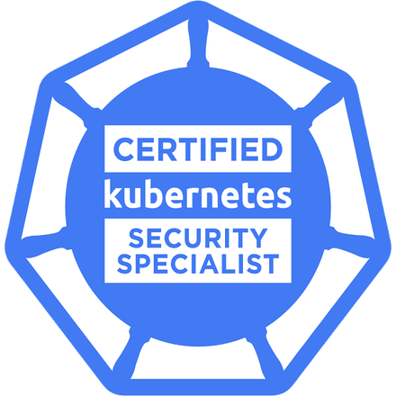
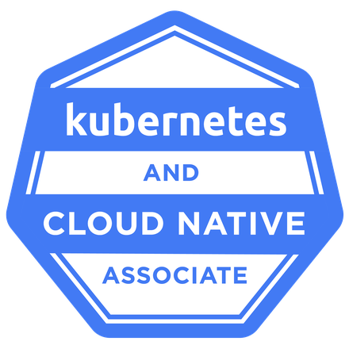

# Hey there, I'm Simon Lauger

Welcome to my GitHub profile! I'm a **Consultant, Trainer & Product Builder** focused on Cloud-Native Infrastructure, Platform Engineering, AI Engineering, and Knowledge Sharing.

---

## What I do

- **Cloud Engineering** – Design, build, and operate scalable platforms across AWS, Azure, and hybrid environments
- **Platform Engineering** – GitOps platforms with Kubernetes, ArgoCD, and reusable CI/CD pipelines
- **AI Engineering** – LLM applications, AI agents, RAG systems, and MCP servers – from API integration to production
- **Software & Product Development** – Full-stack development (FastAPI, React, PostgreSQL) and own products, from data model to GitOps operations
- **Containers & Kubernetes** – Guide teams from first pod to production-grade clusters
- **Trainings & Workshops** – Share knowledge through hands-on workshops and real-world examples

---

## Tech Stack

- **Terraform** / **Terragrunt**
- **Kubernetes** / **OpenShift**
- **Helm** / **Helmfile**
- **AWS**, **Azure**
- **GitHub Actions**, **GitLab CI/CD**, **ArgoCD**
- **Puppet**, **Ansible**
- **Go**, **Python**, **TypeScript**, **Bash**
- **FastAPI**, **React**, **PostgreSQL**
- **OpenAI**, **Claude**, **AWS Bedrock**, **MCP**

---

## Certifications

  

  <b>Kubestronaut</b> – holder of all five CNCF Kubernetes certifications 🚀

  
  
  
  
  

Also certified: **ITIL Foundation** (IT Service Management)

All badges are verified on [Credly](https://www.credly.com/users/simon-lauger.a6eb403f).

---

## Current Projects

- **LLM Gateway & Developer Portal** – OpenAI-compatible multi-provider gateway with MCP registry, IT security dashboard, and multi-tenant isolation
- **OpenShift AI & Virtualization Platform** – AI infrastructure, GPU workloads, and virtualization on OpenShift
- **Product Development** – Building a full-stack SaaS product with agent-based development workflows
- **Kubernetes Operators** – Developing and maintaining [openvox-operator](https://github.com/slauger/openvox-operator) and [crashloop-operator](https://github.com/slauger/crashloop-operator)

---

## Featured Repositories

### Infrastructure & Kubernetes
- **[hcloud-okd4](https://github.com/slauger/hcloud-okd4)** - Provision OKD4/OpenShift clusters on Hetzner Cloud using Packer, Terraform and Ansible (⭐79)
- **[helm-charts](https://github.com/slauger/helm-charts)** - Collection of Helm charts for various use cases
- **[container-gitops-pipeline](https://github.com/slauger/container-gitops-pipeline)** - Reusable GitHub Actions workflows for container-based GitOps pipelines
- **[hugo-gitops-pipeline](https://github.com/slauger/hugo-gitops-pipeline)** - Reusable GitHub Actions workflow for Hugo sites with GitOps deployment
- **[gitops-image-replacer](https://github.com/slauger/gitops-image-replacer)** - CLI tool to automatically update container image references in GitHub repositories
- **[gitops-replacer](https://github.com/slauger/gitops-replacer)** - Marker-based value replacer for GitOps repositories, updates YAML files via GitHub API
- **[openshift-sdk](https://github.com/slauger/openshift-sdk)** - All-in-one container image for OpenShift CI/CD pipelines (oc, kubectl, helm, helmfile, ansible, vault, govc)
- **[openshift-update-proxy](https://github.com/slauger/openshift-update-proxy)** - Update graph, mirror and release signature proxy for disconnected OpenShift clusters

### Configuration Management & Automation
- **[openvox-operator](https://github.com/slauger/openvox-operator)** - Kubernetes Operator for running OpenVox (Puppet) environments on Kubernetes/OpenShift with rootless containers (⭐18)
- **[crashloop-operator](https://github.com/slauger/crashloop-operator)** - Kubernetes Operator that scales down workloads stuck in CrashLoopBackOff and similar terminal failure states
- **[chantal](https://github.com/slauger/chantal)** - Unified CLI tool for offline repository mirroring across multiple package ecosystems (RPM, APT, APK, Helm)

### Monitoring & Networking
- **[check_netscaler](https://github.com/slauger/check_netscaler)** - Nagios Plugin for Citrix ADC using the NITRO API (⭐37)
- **[netscaler-certbot-hook](https://github.com/slauger/netscaler-certbot-hook)** - Automatic installation and renewal of SSL certificates on Citrix NetScaler ADCs (⭐15)
- **[alertmanager-graph-bridge](https://github.com/slauger/alertmanager-graph-bridge)** - Lightweight bridge between Prometheus Alertmanager and the Microsoft Graph API

### AI & Creative Tools
- **[bedrock-s3-vectors-rag](https://github.com/slauger/bedrock-s3-vectors-rag)** - RAG pipeline with AWS Bedrock, S3 and vector databases
- **[suno-cli](https://github.com/slauger/suno-cli)** - Command-line tool to generate music with Suno AI. Input lyrics + style, output MP3 (⭐14)
- **[greeting-card-generator](https://github.com/slauger/greeting-card-generator)** - YAML-based greeting card generator for creating cards without fighting Word margins

### Apps & Utilities
- **[dictctl](https://github.com/slauger/dictctl)** - CLI tool for dictation: microphone recording → Whisper transcription → text on stdout
- **[mta-lernplattform](https://github.com/slauger/mta-lernplattform)** - Interactive quiz app for firefighter training (Modulare Truppausbildung)
- **[resume-web](https://github.com/slauger/resume-web)** - Modern JSON-based resume with markdown support, skill filter & PDF/Markdown export
- **[espresso-macos](https://github.com/slauger/espresso-macos)** - Keep your macOS apps awake - Session keepalive + audio/visual notification monitoring

---

## About Me

I'm a cloud-native enthusiast who completed his first triathlon and half marathon this year – now looking forward to an Ironman 70.3.

When I'm not in a terminal, you'll find me outdoors running trails, exploring mountains, or recovering with strong coffee and metal playlists.

---

## Let's Connect

- **Website:** [lauger.de](https://lauger.de)
- **LinkedIn:** [linkedin.com/in/simon-lauger](https://www.linkedin.com/in/simon-lauger/)
- **GitHub:** [github.com/slauger](https://github.com/slauger)
- **GitLab:** [gitlab.com/slauger](https://gitlab.com/slauger)
- **Email:** simon@lauger.de
